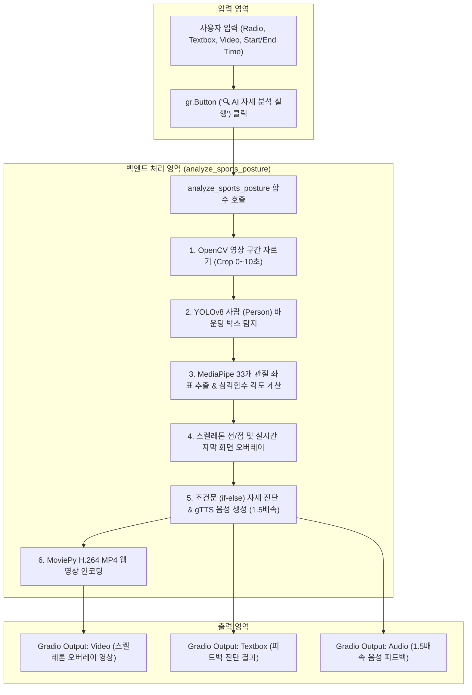

# 🏃‍♂️ [AI 동반 코치(Co-Coach) 코코](https://huggingface.co/spaces/lilyjeongwon/hf_rope)

**"AI 동반 코치(Co-Coach) 코코"**는 체육 수업 시간 중 학생들의 운동 자세(줄넘기, 축구, 달리기, 멀리뛰기)를 비전 AI 기술로 분석하고, 실시간 스켈레톤 시각화 및 1.5배속 음성 피드백을 제공하는 웹 대시보드 앱입니다.


## 🔄 시스템 동작 흐름도 (Mermaid Flowchart)



## app.py 소스코드 동작 절차


> - **01~02 라이브러리 로드**: OpenCV, NumPy, MediaPipe, YOLO, gTTS, Gradio 등 프로젝트 필수 패키지를 가져옵니다.

> - **폴더 생성**: 생성된 오디오 및 비디오 파일을 안전하게 저장할 audio/와 video/ 디렉터리를 자동 생성합니다.

> - **05~06 AI 모델 로드**: MediaPipe Pose 모델(pose_landmarker.task) 및 YOLOv8 Nano 모델(yolov8n.pt)을 준비합니다.

> - **07 각도 계산 함수 (calculate_angle)**: 세 점의 좌표로부터 아크탄젠트(arctan2) 삼각함수를 계산하여 관절 사이각(0~180도)을 구합니다.

> - **12~13 음성 생성 함수 (create_tts_audio)**: gTTS로 텍스트를 음성 변환한 후 MoviePy를 통해 1.5배속 빠른 MP3 파일로 인코딩합니다.

> - **14 웹 영상 코덱 변환 (convert_to_h264_web_video)**: 브라우저에서 영상이 정상 재생되도록 H.264(libx264) 코덱으로 저장합니다.

> - **04, 08~11 핵심 분석 엔진 (analyze_sports_posture)**: 영상을 구간 슬라이싱하고, YOLO와 MediaPipe로 관절 스켈레톤을 시각화하며, 각도 기준 조건문으로 피드백 텍스트와 음성을 생성합니다.

> - **03, 15~17 Gradio UI 구축 및 실행**: 웹 인터페이스 입력창과 출력 대시보드를 배치하고 클릭 이벤트에 분석 함수를 연결하여 서버를 구동합니다.

```plaintext
title: Hf Rope
emoji: 🏆
colorFrom: gray
colorTo: blue
sdk: gradio
sdk_version: 6.29.1
python_version: '3.12'
app_file: app.py
pinned: false
license: mit
short_description: 'YOLO & MediaPipe '
```

Check out the configuration reference at https://huggingface.co/docs/hub/spaces-config-reference