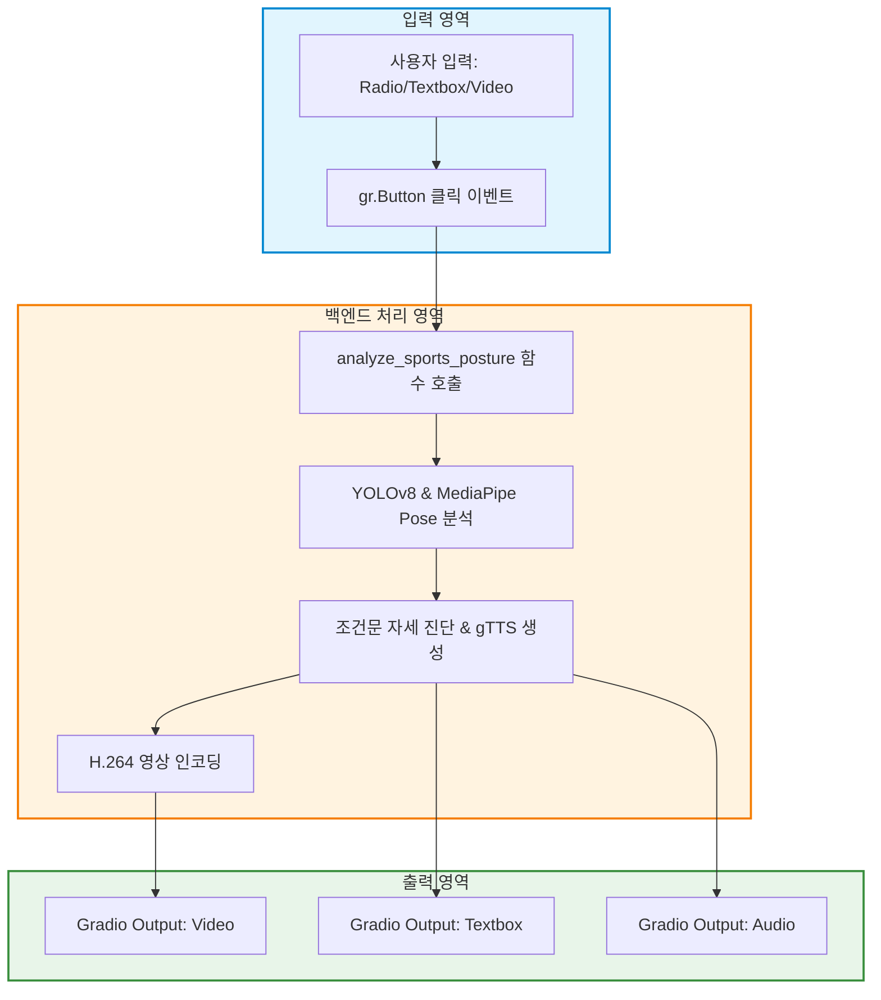

pip install -q "numpy<2" "opencv-python<5" mediapipe ultralytics gradio gtts moviepy

---
marp: true
theme: default
paginate: true
header: "AI 체육 자세 분석 및 피드백 시스템"
footer: "정보 & 체육 융합 수업 프로젝트"
style: |
  section {
    font-family: 'Pretendard', 'Gothic', sans-serif;
    background-color: #f8fafc;
    padding: 40px 60px;
  }
 
  h1 { color: #0f172a; font-size: 2.1em; }
  h2 { color: #2563eb; font-size: 1.4em; border-bottom: 2px solid #cbd5e1; padding-bottom: 8px; }
  h3 { color: #475569; font-size: 1.1em; }
  p, li { color: #334155; font-size: 0.9em; line-height: 1.6; }
  strong { color: #1e40af; }
  code { background-color: #e2e8f0; color: #0f172a; padding: 2px 6px; border-radius: 4px; font-size: 0.85em; }
  pre { background-color: #d4d4d4; color: #d4d4d4; border-radius: 8px; padding: 12px; font-size: 0.78em; border: 2px solid #3c3c3c; border-radius: 6px; }
  table { font-size: 0.82em; width: 100%; margin-top: 10px; }
  th { background-color: #2563eb; color: white; }
  blockquote { border-left: 5px solid #2563eb; background-color: #eff6ff; padding: 8px 12px; margin-top: 10px; }
---
## [01] YOLO와 MediaPipe로 구축하는 피트니스 Agent

* **AI와 운동의 만남**: 인공지능 기술이 스포츠 분석 및 자세 교정에 어떻게 활용되는지 이해합니다.
* **프로젝트 목적**: 영상 속 관절 변화를 분석하여 실시간 자세 피드백 제공
* **핵심 기술 요소**:

  1. **컴퓨터 비전**: 영상 속 인물(YOLOv8)과 관절 좌표를 추적•탐지하는 MediaPipe Pose 기술의 원리 탐구.
  2. **수학적 자세 진단**: 관절 위치 기반 꺾임 각도 계산하여 올바른 운동 자세인지 판단하는 알고리즘 코딩.
  3. **멀티미디어 피드백**: 시각 자막 및 음성(TTS) 안내.
  4. **대시보드 앱 구현**: Gradio 라이브러리로 영상을 업로드하고 음성 피드백(gTTS)을 받을 수 있는 AI 체육 앱을 완성.

---

## [02] Python 개발 환경 및 필수 라이브러리 구성

OpenCV, NumPy, MediaPipe, Ultralytics, Gradio, gTTS, MoviePy 필수 라이브러리의 역할 및 환경 구축 방법을 배웁니다.

### 📦 AI 체육 앱을 만드는 핵심 도구 상자

핵심 라이브러리의 역할과 기능을 한눈에 파악합니다.

```python
# 필수 라이브러리 설치
# %pip install -q "numpy<2" "opencv-python<5" mediapipe ultralytics gradio gtts moviepy

import cv2                   # 영상 및 이미지 처리
import numpy as np           # 수학 및 배열 계산
import mediapipe as mp       # 관절 추적 AI
from ultralytics import YOLO  # 사람 탐지 AI
from gTTS import gTTS        # 텍스트 -> 음성 변환
import gradio as gr          # 파이썬 웹 UI 생성
```

---

### 핵심 라이브러리의 역할과 기능을 한눈에 파악합니다.

- cv2 (OpenCV): 비디오 프레임을 읽고, 도형(바운딩 박스·뼈대)을 그리며, 새로운 동영상 파일로 저장하는 영상 처리 라이브러리입니다.
- numpy (NumPy): 프레임 데이터(행렬) 및 관절 좌표의 삼각함수 각도를 고속으로 계산합니다.
- mediapipe: 구글에서 개발한 AI 프레임워크로, 몸의 주요 관절 33개 위치를 실시간 추적합니다.
- ultralytics (YOLOv8): 영상 속에서 사람의 위치를 빠르게 찾아내는 객체 탐지 인공지능입니다.
- gtts & moviepy: 진단 결과를 한국어 음성(MP3)으로 변환하고 1.5배속으로 속도를 조절합니다.
- gradio: 복잡한 HTML/CSS 없이 파이썬 코드만으로 웹 대시보드 화면을 구축합니다.

---

## [03] Gradio 라이브러리 기초와 UI 레이아웃 설계

### Gradio UI 컴포넌트 구성 요소

```python
import gradio as gr

with gr.Blocks(title="피트니스 AI") as demo:
    gr.Markdown("# 🏃‍♂️ 피트니스 AI 대시보드")
    selected_sport = gr.Radio(choices=["줄넘기", "달리기", "축구"], value="줄넘기", label="종목 선택")
    student_id_input = gr.Textbox(label="학번")
    student_name_input = gr.Textbox(label="이름")
    video_input = gr.Video(label="운동 영상 업로드")
    btn_analyze = gr.Button("🔍 AI 자세 분석 실행", variant="primary")
```

---

## [04] AI 분석용 영상 데이터 업로드 및 구간 Cut 처리

### 특정 시간 범위 영상 자르기 (Crop)

```python
import cv2

cap = cv2.VideoCapture("input.mp4")
fps = cap.get(cv2.CAP_PROP_FPS) or 30.0
start_frame = int(0.0 * fps) # 시작 시간(초)
end_frame = int(5.0 * fps)   # 종료 시간(초)

cap.set(cv2.CAP_PROP_POS_FRAMES, start_frame)
# 지정 프레임 범위만 VideoWriter로 재저장
```

---

## [05] YOLOv8 객체 탐지 모델 로드 및 사람 감지

### 모델 명세 및 용도

- **다운로드 URL**:

  - https://github.com/ultralytics/assets/releases/download/v8.2.0/yolov8n.pt
- **주요 용도**: 영상 내 수많은 물체 중 사람(Person) 클래스 위치 탐지

```python
from ultralytics import YOLO

yolo_model = YOLO('yolov8n.pt')
results = yolo_model(frame, verbose=False)[0]
```

---

## [06] MediaPipe Pose Landmarker와 관절 좌표

### 🤖 모델 명세 및 용도

- **다운로드 URL**: https://storage.googleapis.com/mediapipe-models/pose_landmarker/pose_landmarker_heavy/float16/1/pose_landmarker_heavy.task
- **주요 용도**: 사람 몸의 **33개 관절 점(Landmark)** 좌표 추출

```python
import mediapipe as mp
from mediapipe.tasks import python
from mediapipe.tasks.python import vision

base_options = python.BaseOptions(model_asset_path='pose_landmarker.task')
options = vision.PoseLandmarkerOptions(base_options=base_options)
pose_detector = vision.PoseLandmarker.create_from_options(options)
```

---

- **주요 용도**: 사람 몸의 **33개 관절 점(Landmark)** 좌표 추출

```python
# 1) MediaPipe Pose 모델 다운로드 및 로드
POSE_MODEL_PATH = 'pose_landmarker.task'
url = "https://storage.googleapis.com/mediapipe-models/pose_landmarker/pose_landmarker_heavy/float16/1/pose_landmarker_heavy.task"
urllib.request.urlretrieve(url, POSE_MODEL_PATH)

# 2) YOLOv8 모델 로드
yolo_model = YOLO('yolov8n.pt')  # PyTorch / Ultralytics 허브 자동 다운로드
```

| 구분         | YOLOv8 (Ultralytics)                                          | MediaPipe Pose Heavy                                          |
| ------------ | ------------------------------------------------------------- | ------------------------------------------------------------- |
| 다운로드 URL | yolov8n.pt (Ultralytics GitHub)                               | pose_landmarker_heavy.task (Google Storage)                   |
| 주요 용도    | 영상 내 사람(Person) 영역 탐지                                | 사람 영역 내부에서 33개 관절 좌표 추출                        |
| 작동 특징    | 배경과 사람을 구분하여 위치 좌표$(x_1, y_1, x_2, y_2)$ 전달 | 어깨·팔꿈치·무릎 등 관절 점의$(x, y, z)$ 위치 정규화 반환 |

---

## [07] 관절 각도 계산 수학적 원리와 구현

### 📐 삼각함수 개념 (고1 맞춤 설명)

직각삼각형의 변의 비율과 기울기를 이용해 관절 각도를 구합니다.

- $\tan(\theta)$ **(탄젠트)**: (높이 / 밑변)으로 기울기를 나타냅니다.
- np.arctan2(y, x) **(아크탄젠트)**: 좌표차 $(x, y)$로부터 기울어진 각도를 역으로 구합니다.

```plaintext
직각삼각형과 삼각비                         좌표평면과 arctan2
         /|                                       Y축
        / |                                        |     ● (x, y)
   c   /  |  a (높이)                              |    /
      /   |                                        |   / 
     /θ___|                                        |  / θ (기울기 각도)
       b (밑변)                                     +-------------> X축
  sin(θ) = a / c                                   tan(θ) = y / x
  cos(θ) = b / c                                   θ = arctan2(y, x)
  tan(θ) = a / b
```

---

### 직각삼각형의 변의 비율과 기울기를 이용해 관절 각도를 구합니다.

```python
import numpy as np

def calculate_angle(a, b, c):
    a, b, c = np.array(a), np.array(b), np.array(c)
    # 두 선분의 기울기 각도 차이 계산 (arctan2 활용)
    radians = np.arctan2(c[1] - b[1], c[0] - b[0]) - np.arctan2(a[1] - b[1], a[0] - b[0])
    angle = np.abs(radians * 180.0 / np.pi)  # 라디안 -> 도(degree) 변환
    if angle > 180.0: angle = 360.0 - angle
    return angle
```

- 삼각비 ($\sin, \cos, \tan$): 직각삼각형에서 두 변의 길이에 대한 비율을 의미합니다. $\tan(\theta)$는 (높이 / 밑변)으로 기울기를 나타냅니다.
- 아크탄젠트 ($\arctan2$): 변의 비율이나 좌표 값 $(x, y)$을 입력받아 기울어진 각도($\theta$)를 역으로 구해주는 함수입니다. 관절 $b$(팔꿈치)를 중심으로 $a$(어깨)와 $c$(손목) 사이의 꺾인 각도를 $0^\circ \sim 180^\circ$로 유도합니다.

---

## [08] 영상 프레임 위 YOLO Bounding Box 시각화

```python
import cv2

for box in yolo_results.boxes:
    cls_id = int(box.cls[0])
    if yolo_model.names[cls_id] == 'person':
        x1, y1, x2, y2 = map(int, box.xyxy[0])
        cv2.rectangle(frame, (x1, y1), (x2, y2), (255, 120, 0), 2)
        cv2.putText(frame, "Person", (x1, y1 - 10), cv2.FONT_HERSHEY_SIMPLEX, 0.5, (255, 120, 0), 2)
```

---

## [09] 영상 프레임 위 MediaPipe 스켈레톤 시각화

```python
import cv2

# 관절 점을 잇는 선과 원 그리기
cv2.line(frame, tuple(l_shoulder), tuple(l_elbow), (255, 0, 0), 3)
cv2.line(frame, tuple(l_elbow), tuple(l_wrist), (255, 0, 0), 3)
cv2.circle(frame, tuple(l_elbow), 6, (0, 0, 255), -1)
```

---

## [10] 화면 상단 실시간 분석 정보 자막 오버레이

```python
import cv2

# 반투명 배경 상자 및 실시간 관절 각도 자막
cv2.rectangle(frame, (10, 10), (480, 90), (0, 0, 0), -1)
cv2.putText(frame, f"Info: {caption_info}", (20, 35), cv2.FONT_HERSHEY_SIMPLEX, 0.6, (255, 255, 255), 2)
cv2.putText(frame, f"Elbow: {int(elbow)}deg | Knee: {int(knee)}deg", (20, 70), cv2.FONT_HERSHEY_SIMPLEX, 0.5, (0, 255, 255), 2)
```

---

## [11] 운동 종목별 자세 자동 진단 알고리즘

### 조건문(if-else)을 이용한 자세 진단

- 수집된 평균 각도 데이터를 기반으로 맞춤형 피드백을 결정합니다.

```python
# 평균 각도를 비교하여 조건에 맞춰 피드백 메시지 결정
if 80 <= avg_elbow <= 120:
    feedback_msgs.append("1. 팔꿈치 각도: 양호합니다.")
else:
    feedback_msgs.append("1. 팔꿈치 각도: 주의가 필요합니다.")

if avg_trunk < 15:
    feedback_msgs.append("2. 상체 기울임: 양호합니다.")
else:
    feedback_msgs.append("2. 상체 기울임: 경고! 상체가 기울어졌습니다.")
```

---

### 조건문(if-else)을 이용한 자세 진단

- **if 조건문:** 주어진 조건식이 True(참)인지 False(거짓)인지 판단하는 제어문입니다.
- **진단 로직 원리:**
  - avg_elbow 값이 $80^\circ \sim 120^\circ$ 사이에 위치하면 **양호**, 범위를 벗어나면 **주의** 메시지를 채택합니다.
  - 상체 기울임 각도가 $15^\circ$ 미만이면 올바른 자세, $15^\circ$ 이상 기울어지면 **경고** 메시지를 추가합니다.

---

## [12 & 13] gTTS: 음성 피드백 생성 및 MoviePy: 음성 1.5배속 조절

### 🔊 gTTS 엔진 & MoviePy 배속 조절

텍스트 진단 결과를 음성으로 변환하고 재생 속도를 조절하는 원리입니다.

```python
from gtts import gTTS
from moviepy.editor import AudioFileClip

def create_tts_audio(text_message, output_path="feedback_audio.mp3", speed=1.5):
    temp_mp3 = "temp_gtts_sound.mp3"
  
    # 1) gTTS: 텍스트를 음성 MP3 파일로 변환
    tts = gTTS(text=text_message, lang='ko')
    tts.save(temp_mp3)
  
    # 2) MoviePy: 1.5배속 변환
    audio_clip = AudioFileClip(temp_mp3)
    fast_audio = audio_clip.speedx(factor=speed)
    fast_audio.write_audiofile(output_path, verbose=False, logger=None)
    return output_path
```

- gTTS (Google Text-to-Speech): 구글 음성 합성 API를 사용하여 텍스트 문자열을 한국어 자연어 음성 파일(.mp3)로 생성합니다.
- MoviePy (speedx): 생성된 오디오의 핏치(음높이) 변형을 최소화하면서 템포(속도)를 1.5배 빠르게 조절하여, 체육 현장에서 지루함 없이 빠르게 피드백을 청취할 수 있도록 돕습니다.

---

## [14] 웹 재생을 위한 H.264 코덱 변환

### 🎬 비디오 코덱(Codec)과 자동 인코딩

- OpenCV 기본 코덱(mp4v)은 웹 브라우저에서 재생되지 않는 문제 해결 하기위해 웹 표준인 H.264(libx264)로 변환해야 검은 화면 없이 정상 재생됩니다.

```python
def convert_to_h264_web_video(input_path, output_path):
    # OpenCV 기본 저장 코덱(mp4v)을 웹 표준 코덱(H.264/libx264)으로 재인코딩
    clip = VideoFileClip(input_path)
    clip.write_videofile(output_path, codec="libx264", audio=False)
    clip.close()
    return output_path
```

---

### 웹 표준인 H.264(libx264)로 변환 메커니즘

```plaintext
[OpenCV 기본 저장]          [MoviePy 재인코딩]              [Gradio 웹 UI]
 mp4v (mp4v2) 코덱    --->   libx264 (H.264) 코덱 변환   --->   웹 브라우저 정상 재생
 (웹 브라우저 재생 불가)                                      (검은 화면 문제 해결)
```

- **비디오 코덱(Codec):** 영상의 방대한 용량을 압축하고 해제하는 기술 규격입니다.
- **작동 원리:** OpenCV의 mp4v 코덱은 로컬 환경에서는 잘 열리지만 Chrome, Safari 등 웹 브라우저 호환성이 떨어집니다. MoviePy를 이용해 H.264(libx264) 표준 코덱으로 변환하여 웹 UI에서 검은 화면 없이 영상을 재생시킵니다.

---

## [15] Gradio UI와 AI 분석 엔진 함수 연결

### 🖱️클릭 이벤트 및 및 함수 연결(Event Driven Programming)

버튼 클릭 시 입력값을 전달하고 결과값을 받아오는 매핑 구조입니다.

- btn_analyze.click() 이벤트 매핑을 통해 입력 컴포넌트 목록(inputs)을 analyze_sports_posture 함수로 넘기고, 결과값을 출력 컴포넌트(outputs)에 전달합니다.

```python
# 버튼 클릭 이벤트 처리 연결
btn_analyze.click(
    fn=analyze_sports_posture,  # 실행할 AI 분석 함수
    inputs=[                    # 함수로 전달될 입력 컴포넌트 목록
        selected_sport, 
        student_id_input, 
        student_name_input, 
        video_input, 
        start_time_input, 
        end_time_input
    ],
    outputs=[                   # 함수 반환값이 표출될 출력 컴포넌트 목록
        output_video, 
        output_feedback, 
        output_audio
    ]
)
```

---

### 🖱️클릭 이벤트 및 및 함수 연결(Event Driven Programming)

```plaintext
[btn_analyze.click] 
   │
   ├── inputs  --> (selected_sport, student_id, student_name, video, start, end)
   │                      │
   │                      ▼
   │            [analyze_sports_posture()]
   │                      │
   └── outputs <-- (final_output_video, final_feedback_text, audio_path)
```

---

### 🖥️ Gradio UI 대시보드 컴포넌트

- 사용자 입출력을 담당하는 Gradio 컴포넌트 구조입니다.

```python
with gr.Blocks(title="피트니스 AI") as demo:
    selected_sport = gr.Radio(choices=["줄넘기", "달리기", "축구"], value="줄넘기")
    student_id_input = gr.Textbox(label="학번")
    student_name_input = gr.Textbox(label="이름")
    video_input = gr.Video(label="운동 영상 업로드")
    btn_analyze = gr.Button("🔍 AI 자세 분석 실행", variant="primary")
  
    output_video = gr.Video(label="분석 결과 영상")
    output_feedback = gr.Textbox(label="피드백 진단 결과")
    output_audio = gr.Audio(label="음성 피드백")
```

---

### 🖥️ Gradio UI 대시보드 컴포넌트

| 컴포넌트 종류 | 설명 및 역할                                                  |
| ------------- | ------------------------------------------------------------- |
| gr.Radio      | 여러 운동 종목 중 하나를 선택하는 단일 선택 단추입니다.       |
| gr.Textbox    | 학번, 이름 입력 및 텍스트 진단 결과를 출력합니다.             |
| gr.Video      | 분석할 원본 비디오를 업로드하거나 결과 비디오를 시각화합니다. |
| gr.Button     | 사용자 클릭 이벤트를 발생시켜 분석 엔진을 가동합니다.         |
| gr.Audio      | 생성된 MP3 피드백 음성을 플레이어로 재생합니다.               |

---

## [16] Gradio 대시보드 결과 출력 흐름도

### 🔄 데이터 파이프라인 흐름

입력 데이터가 AI 엔진을 거쳐 결과 컴포넌트로 전달되는 흐름입니다.

flowchart TD
    A[사용자 입력: Radio/Textbox/Video] --> B[gr.Button 클릭 이벤트]
    B --> C[analyze_sports_posture 함수 호출]
    C --> D[YOLOv8 & MediaPipe Pose 분석]
    D --> E[조건문 자세 진단 & gTTS 생성]
    E --> F[H.264 영상 인코딩]
    F --> G[Gradio Output: Video]
    E --> H[Gradio Output: Textbox]
    E --> I[Gradio Output: Audio]

- UI 컴포넌트에 입력된 매개변수가 분석 함수 analyze_sports_posture로 전달됩니다.
- 분석이 완결되면 **영상, 텍스트, 오디오** 3가지 결과 데이터가 각각의 Gradio 출력 컴포넌트로 동시 전송됩니다.

---

## [17 & 18] 외부 공유 및 예외 처리

### 공유 서버 생성 및 프로그램 안정성 확보

```python
# 17. Gradio 외부 라이브 공유 링크 생성
if __name__ == "__main__":
    demo.launch(share=True)  # https://xxxx.gradio.live 링크 생성

# 18. 예외 처리(try-except)를 이용한 시스템 안점성 확보
try:
    audio_clip = AudioFileClip(temp_mp3)
    fast_audio = audio_clip.speedx(factor=1.5)
    fast_audio.write_audiofile(output_path)
except Exception as e:
    print(f"오류 발생: {e}. 원본 오디오 파일로 대체합니다.")
    output_path = temp_mp3
```

---

### 공유 서버 생성 및 프로그램 안정성 확보

- share=True **(공유 링크)**: 구글 코랩 내부 서버를 파이프 통신(Tunneling)하여 외부 사용자(학생, 교사)가 스마트폰이나 개인 PC로 접속할 수 있는 임시 URL([https://xxx.gradio.live](https://xxx.gradio.live))을 자동 발행합니다.
- **예외 처리 (try-except)**: 라이브러리 미설치, 파일 경로 오류, 지원하지 않는 동영상 코덱 형식 등 예상치 못한 오류가 발생하더라도 프로그램이 갑자기 종료되지 않고 안정적으로 구동되도록 비상 흐름(Fallback)을 제공합니다.

---

## [08~11] AI 엔진 핵심 분석

### ⚙️ 입출력 데이터 흐름 및 진단 정확도 향상 가이드

- AI 모델이 영상을 처리하는 단계별 메커니즘과 촬영 가이드입니다.

```python
# 1) 입력 형식: OpenCV BGR Image (Numpy Array / Shape: [H, W, 3])
rgb_frame = cv2.cvtColor(frame, cv2.COLOR_BGR2RGB)
mp_img = mp.Image(image_format=mp.ImageFormat.SRGB, data=rgb_frame)

# 2) YOLO 감지 및 MediaPipe 관절 추적
yolo_results = yolo_model(frame, verbose=False)[0]
detection_result = pose_detector.detect(mp_img)
```

### 입출력 데이터 흐름

```plaintext
[입력 데이터] OpenCV BGR 프레임 (H, W, 3)
      │
      ├──> [YOLOv8 Detection] -> 사람 위치 bounding box (x1, y1, x2, y2)
      │
      └──> [MediaPipe Pose] -> 33개 관절 좌표 (x, y) -> 삼각함수 각도 계산
```

### 💡 AI가 올바르게 진단할 수 있도록 촬영하는 기법

- **측면 촬영 기준 유지를 권장합니다:** 관절 각도 계산은 2차원 평면 기반이므로 정면보다 측면에서 촬영할 때 관절이 겹치지 않아 정확도가 상승합니다.
- **단일 사용자 촬영을 권장합니다:** YOLO 및 MediaPipe가 다수의 사용자를 동시에 감지할 때 발생할 수 있는 관절 꼬임 현상을 방지합니다.
- **밝은 조명과 명확한 대비를 제공합니다:** 배경과 옷의 색상이 명확히 구분될수록 관절 추정 오차가 줄어듭니다

---

### AI에게 가드레일 제시

- 줄넘기, 달리기, 축구
- 종목별 조건 설정이 필요
- 수행평가 채점기준

### 최종 판단은 교사가


