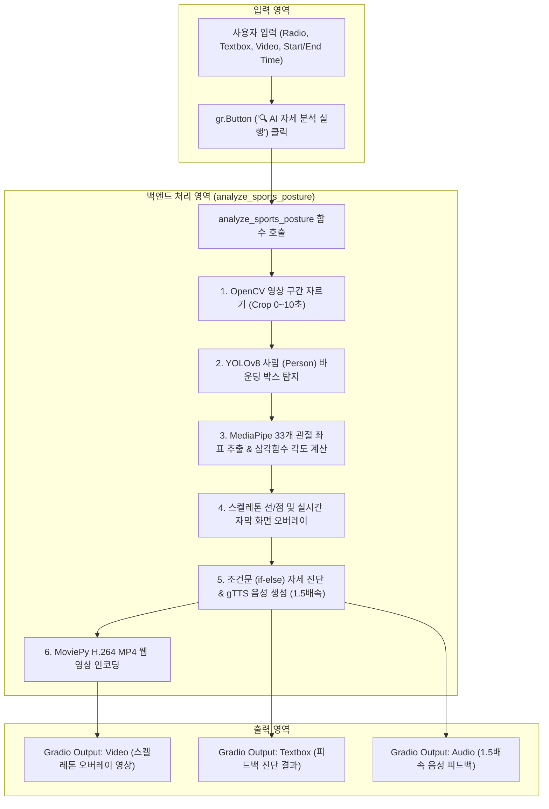

```mermaid
flowchart TD
    %% 입력 영역
    subgraph UI_Input["입력 영역"]
        A["사용자 입력 (Radio, Textbox, Video, Start/End Time)"]
        B["gr.Button ('🔍 AI 자세 분석 실행') 클릭"]
        A --> B
    end

    %% 백엔드 처리 영역
    subgraph Backend["백엔드 처리 영역 (analyze_sports_posture)"]
        C["analyze_sports_posture 함수 호출"]
        D["1. OpenCV 영상 구간 자르기 (Crop 0~10초)"]
        E["2. YOLOv8 사람 (Person) 바운딩 박스 탐지"]
        F["3. MediaPipe 33개 관절 좌표 추출 & 삼각함수 각도 계산"]
        G["4. 스켈레톤 선/점 및 실시간 자막 화면 오버레이"]
        H["5. 조건문 (if-else) 자세 진단 & gTTS 음성 생성 (1.5배속)"]
        I["6. MoviePy H.264 MP4 웹 영상 인코딩"]

        B --> C
        C --> D
        D --> E
        E --> F
        F --> G
        G --> H
        H --> I
    end

    %% 출력 영역
    subgraph UI_Output["출력 영역"]
        J["Gradio Output: Video (스켈레톤 오버레이 영상)"]
        K["Gradio Output: Textbox (피드백 진단 결과)"]
        L["Gradio Output: Audio (1.5배속 음성 피드백)"]

        I --> J
        H --> K
        H --> L
    end
```
